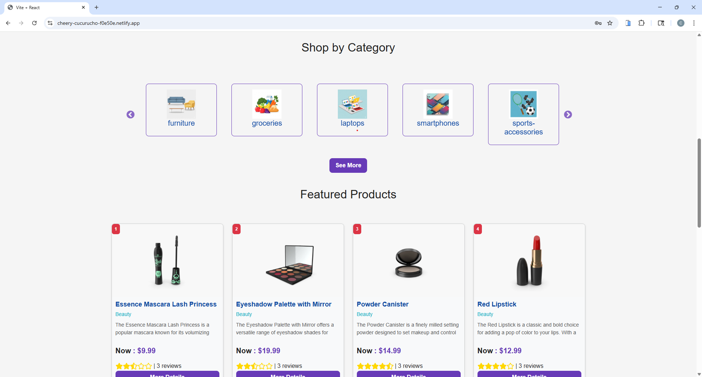
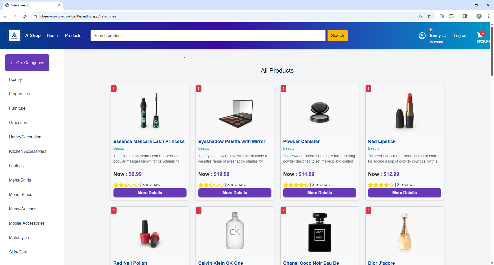
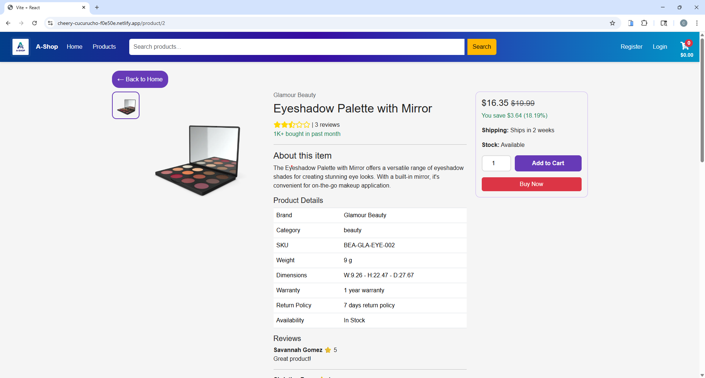
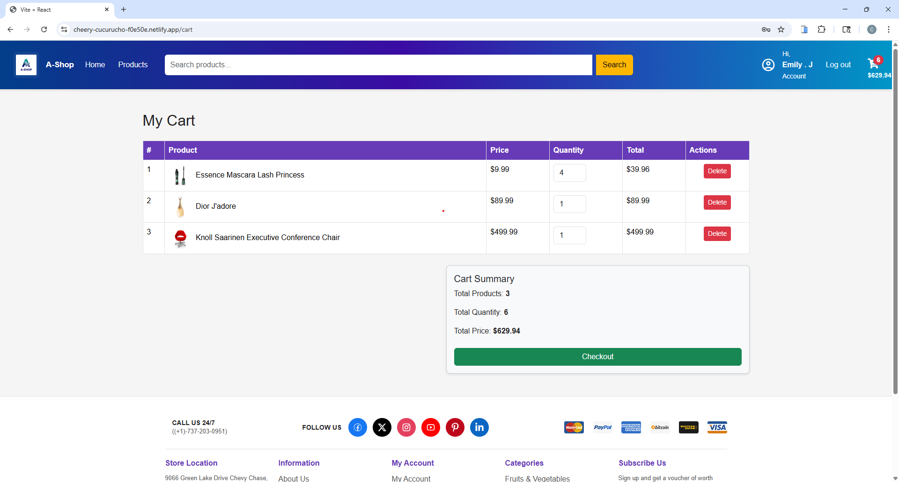
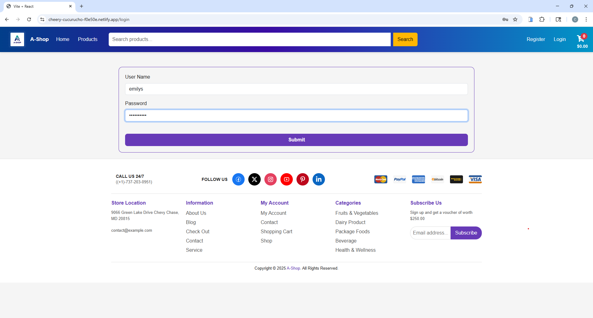
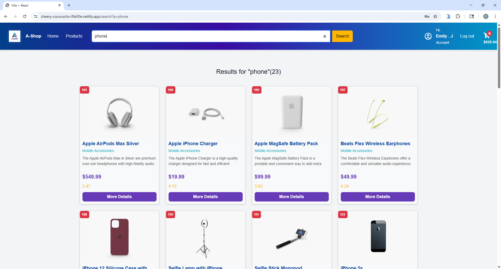

# 🛒 A-Shop: Online E-Commerce Store

🌐 **Live Demo:** [https://a-shop-onlinestore.netlify.app/](https://a-shop-onlinestore.netlify.app/)

---

## 📖 Description

**A-Shop** is a fully interactive e-commerce web application built with React. Users can browse products, filter by category, view product details, search for products, and manage their shopping cart seamlessly.

This project demonstrates practical usage of **React, Context API, React Query, Formik & Yup, JWT decoding, and Local Storage**, simulating a real online store using a **dummy API**.

### About This Project

The project focuses on front-end e-commerce functionality:

- Fetches all products, categories, and product details from a **dummy API**.
- Implements **Login functionality** with pre-defined dummy credentials (`emilys / emilyspass`) and JWT decoding to extract user information.
- Shopping cart fully managed in **Local Storage** (add, delete, update, and calculate totals).
- Uses **Context API** and **React Query** for state and data management.
- Form validation handled by **Formik & Yup** for both login and registration pages (registration page UI only, not functional due to API limitations).
- **Product search functionality** to quickly find items by name or category.

---

## 🚀 Features

- 🛍️ Browse all products and filter by categories.
- 🔍 View detailed product information.
- 🔎 Search for products by name or category.
- 🛒 Add, remove, and update products in the cart.
- 💰 Calculate cart totals dynamically.
- 🔐 Login page with Formik & Yup validation and JWT decoding.
- 📝 Form validation for registration page UI (dummy, non-functional).
- ⚡ Smooth front-end experience using **React Context & React Query**.

---

## 🛠️ Technologies Used

- **React** – UI building and state management
- **Context API** – Global state management
- **React Query** – Data fetching and caching
- **Formik & Yup** – Form handling and validation
- **JWT Decode** – Decode user token information
- **Local Storage** – Cart persistence
- **Axios** – API requests
- **React Router** – Routing
- **Bootstrap** – Styling and responsive design
- **React Icons & Font Awesome** – Icons
- **React Slick & Slick Carousel** – Product sliders
- **React Toastify** – Notifications

---

## 🎨 Colors & UI Style

- **Primary Color:** #007bff (Buttons, links, highlights)
- **Secondary Color:** #6c757d (Text, secondary buttons)
- **Background:** #f8f9fa (Light grey background)
- **Cart Total / Price:** #28a745 (Green to highlight)
- **Hover Effect for Buttons/Links:** Slightly darker shade of primary color (#0069d9)
- **Font:** 'Roboto', sans-serif

---

## 📷 Preview

**Home Page**  


**Productس Page**  



**Product Details Page**  


**Cart Page**  


**Login Page**  


**Search Functionality**  


---

## 📌 Future Improvements

- Implement **fully functional registration page** connected to a real backend.
- Add **real authentication** with server-side login.
- Improve UI with **dark/light mode toggle**.
- Enhance cart with **wishlist feature**.
- Enable **real payment integration** (e.g., Stripe, PayPal).

---

## ▶️ Usage

1. Clone this repository:

   ```bash
   git clone https:/AmelChenni.com//a-shop-ecommerce.git
